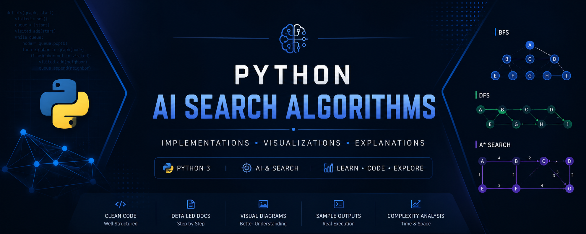

<div align="center">



# Python AI Search Algorithms

**A comprehensive, well-documented collection of classical Artificial Intelligence search algorithms implemented in Python.**

[](https://www.python.org/)
[](LICENSE)
[](#roadmap)
[](#contributing)

</div>

---

## Table of Contents

- [About the Project](#about-the-project)
- [Key Features](#key-features)
- [Algorithms](#algorithms)
- [Project Structure](#project-structure)
- [Technologies Used](#technologies-used)
- [Installation](#installation)
- [How to Run](#how-to-run)
- [Repository Workflow](#repository-workflow)
- [Time & Space Complexity](#time--space-complexity)
- [Learning Outcomes](#learning-outcomes)
- [Screenshots](#screenshots)
- [Roadmap](#roadmap)
- [Contributing](#contributing)
- [License](#license)
- [Author](#author)

---

## About the Project

**Python AI Search Algorithms** is a structured, laboratory-driven repository built to document and implement classical search algorithms used in Artificial Intelligence. It was created as part of an AI laboratory course, but it is organized and maintained to the standard of a production-grade open-source project.

Each algorithm in this repository includes:

- A clean, well-commented Python implementation
- A dedicated documentation page explaining the theory and approach
- Sample execution output
- Time and space complexity analysis

The goal is simple: make AI search algorithms easy to read, easy to run, and easy to learn from — whether you're a student preparing for a lab exam, a beginner exploring AI for the first time, or a recruiter reviewing this profile.

---

## Key Features

- **Clean implementations** — readable, idiomatic Python with no unnecessary dependencies
- **Structured documentation** — every algorithm has its own explanation page under `docs/`
- **Complexity analysis** — time and space complexity documented for each algorithm
- **Visual aids** — diagrams and execution screenshots under `images/`
- **Lab-ready** — original experiment manuals preserved under `lab-manuals/`
- **Scalable structure** — designed to grow cleanly as more experiments are added

---

## Algorithms

| Experiment | Algorithm | Description | Status |
|:----------:|-----------|--------------|:------:|
| 01 | Breadth First Search (BFS) | Explores neighbor nodes level by level using a queue | ✅ Done |
| 02 | Depth First Search (DFS) | Explores as deep as possible along each branch before backtracking | ✅ Done |
| 03 | A* Search | Informed search using path cost and heuristic estimation | ✅ Done |
| 04 | Best First Search | Greedy informed search guided purely by heuristic value | 🔜 Planned |
| 05 | Uniform Cost Search | Expands the lowest cumulative path-cost node first | 🔜 Planned |
| 06 | Hill Climbing | Local search that moves toward increasing heuristic value | 🔜 Planned |
| 07 | AO* | Search over AND-OR graphs for problem decomposition | 🔜 Planned |
| 08 | Minimax | Decision-making algorithm for two-player adversarial games | 🔜 Planned |
| 09 | Alpha-Beta Pruning | Optimized Minimax with branch elimination | 🔜 Planned |
| 10 | Genetic Algorithm | Evolutionary search inspired by natural selection | 🔜 Planned |

---

## Project Structure

```text
python-ai-search-algorithms/
│
├── src/                        # Algorithm implementations
│   ├── bfs.py
│   ├── dfs.py
│   ├── astar.py
│   └── ...
│
├── docs/                       # Per-algorithm documentation
│   ├── bfs.md
│   ├── dfs.md
│   ├── astar.md
│   └── ...
│
├── images/                     # Banner, diagrams, execution screenshots
│   ├── banner.png
│   └── ...
│
├── lab-manuals/                # Original experiment PDFs
│   └── ...
│
├── requirements.txt             # Project dependencies
├── .gitignore
├── LICENSE
└── README.md
```

---

## Technologies Used

| Category | Tools |
|----------|-------|
| Language | Python 3 |
| Data Structures | `collections.deque`, `heapq` |
| Documentation | Markdown (GFM) |
| Version Control | Git & GitHub |

---

## Installation

Clone the repository and set up a virtual environment:

```bash
git clone https://github.com/zahidcodepy/python-ai-search-algorithms.git
cd python-ai-search-algorithms

python -m venv venv
source venv/bin/activate      # On Windows: venv\Scripts\activate

pip install -r requirements.txt
```

---

## How to Run

Each algorithm can be run independently from the `src/` directory.

```bash
# Run Breadth First Search
python src/bfs.py

# Run Depth First Search
python src/dfs.py

# Run A* Search
python src/astar.py
```

> Each script prints the search process and final path/output directly to the console.

---

## Repository Workflow

To keep the repository consistent as new experiments are added:

| Content Type | Location |
|---------------|----------|
| Algorithm source code | `src/` |
| Algorithm explanation & theory | `docs/` |
| Diagrams, banners, execution screenshots | `images/` |
| Original lab experiment PDFs | `lab-manuals/` |

Every new algorithm added to `src/` should be paired with a corresponding page in `docs/` and, where relevant, a diagram or screenshot in `images/`.

---

## Time & Space Complexity

| Algorithm | Time Complexity | Space Complexity |
|-----------|:----------------:|:-----------------:|
| Breadth First Search (BFS) | O(V + E) | O(V) |
| Depth First Search (DFS) | O(V + E) | O(V) |
| A* Search | O(E) — depends on heuristic | O(V) |

*V = number of vertices/nodes, E = number of edges.*

---

## Learning Outcomes

Through this repository, the following AI and software engineering concepts are demonstrated:

- Understanding of uninformed and informed search strategies
- Practical implementation of graph traversal techniques
- Heuristic design and evaluation in informed search
- Complexity analysis of search algorithms
- Structuring and documenting a technical codebase to open-source standards

---

## Screenshots

> Execution screenshots will be added here as experiments are completed.

<div align="center">

<br/><br/>

</div>

---

## Roadmap

- [x] Breadth First Search (BFS)
- [x] Depth First Search (DFS)
- [x] A* Search
- [ ] Best First Search
- [ ] Uniform Cost Search
- [ ] Hill Climbing
- [ ] AO*
- [ ] Minimax
- [ ] Alpha-Beta Pruning
- [ ] Genetic Algorithm
- [ ] Additional AI Lab Experiments

---

## Contributing

This repository primarily documents personal AI laboratory work, but suggestions and improvements are welcome.

1. Fork the repository
2. Create a feature branch (`git checkout -b feature/algorithm-name`)
3. Commit your changes (`git commit -m "Add: algorithm-name implementation"`)
4. Push to the branch (`git push origin feature/algorithm-name`)
5. Open a Pull Request

Please keep new algorithms consistent with the existing folder structure and documentation style.

---

## License

This project is licensed under the **MIT License** — see the [LICENSE](LICENSE) file for details.

---

## Author

**Zahid**

[](https://github.com/zahidcodepy)
[](https://linkedin.com/in/your-linkedin-handle)
[](https://your-portfolio-link.com)

<div align="center">

If this repository helped you, consider giving it a ⭐

</div>
