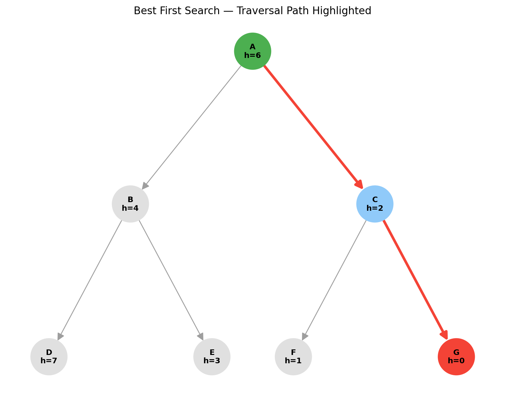

# Best First Search

## Experiment Information

- **Experiment Number:** 04
- **Subject:** Artificial Intelligence / Python Practical
- **Aim:** To write and execute a Python program that implements the Best
  First Search algorithm using heuristic values to select the most
  promising node during graph traversal.
- **Programming Language:** Python 3
- **Algorithm:** Best First Search (Greedy, Heuristic / Informed Search)

## Objective

The objective is to understand how an informed search algorithm uses a
heuristic function h(n) to decide which node should be explored next. Best
First Search gives priority to the node that appears closest to the goal
according to its heuristic value.

## Introduction

Best First Search is a graph search algorithm that, unlike blind search
methods, uses extra information — a heuristic — to guide which node to
explore next. Instead of following a fixed order (like level order in BFS
or depth order in DFS), it always expands whichever available node looks
most promising.

## Theory

Best First Search is an **informed search technique**. It is called a
heuristic search because it relies on a heuristic function h(n) to estimate
how close a node is to the goal, rather than exploring blindly.

- It selects the next node based on an evaluation value — here, h(n).
- In the **greedy version** of Best First Search (used in this practical),
  the node with the **smallest heuristic value** is selected first.
- A **priority queue** keeps the available (frontier) nodes ordered by
  their heuristic values, so the most promising node is always picked next.
- A **visited set** is maintained to avoid repeatedly processing the same
  node.

**Difference from uninformed search:** Uninformed searches like BFS and DFS
have no knowledge of the goal's location and explore based purely on
structure (level or depth). Best First Search uses heuristic knowledge to
actively steer the search toward the goal.

## How Best First Search Works

1. Start from the initial node.
2. Evaluate available nodes using the heuristic h(n).
3. Select the most promising node (smallest h(n)).
4. Expand that node.
5. Add its relevant (unvisited) neighbours to the priority queue.
6. Continue selecting the node with the best heuristic value.
7. Stop when the goal node is reached (or when the priority queue becomes
   empty).

## Heuristic Function

The heuristic function h(n) estimates how close node `n` is to the goal.
For greedy Best First Search, a **lower h(n)** is considered more promising.

Heuristic values used in this practical:

| Node | h(n) |
|------|------|
| A    | 6    |
| B    | 4    |
| C    | 2    |
| D    | 7    |
| E    | 3    |
| F    | 1    |
| G    | 0    |

## Graph Used

**Nodes:** A, B, C, D, E, F, G

**Edges (directed):**
- A → B, C
- B → D, E
- C → F, G

**Start node:** A
**Goal node:** G

```
            A (6)
           /     \
        B (4)    C (2)
       /   \      /   \
    D (7) E (3) F (1) G (0)
```



*Path found by the search (A → C → G) is highlighted in red.*

## Algorithm

1. Initialize a priority queue with the start node and its heuristic value.
2. Create an empty visited set.
3. Remove the node having the smallest heuristic value from the priority
   queue.
4. If the node has already been visited, skip it.
5. Mark the node as visited and add it to the traversal order.
6. If the current node is the goal, stop the search.
7. Otherwise, insert its unvisited neighbours into the priority queue using
   their heuristic values.
8. Repeat until the goal is found or the priority queue becomes empty.

## Python Implementation

The full implementation is available at:
[`../src/best_first_search.py`](../src/best_first_search.py)

## Execution

Run the program from the repository root:

```
python src/best_first_search.py
```

## Expected Output

```
Best First Search Traversal:
A -> C -> G
```

## Step-by-Step Execution

| Step | Current Node | Important Choice | Priority Reason |
|------|---------------|-------------------|------------------|
| 1 | A | Add B, C | h(C)=2 is smaller than h(B)=4 |
| 2 | C | Add F, G | h(G)=0 is smaller than h(F)=1 |
| 3 | G | Goal found | h(G)=0 |

Starting at `A`, its neighbours `B` (h=4) and `C` (h=2) are added to the
priority queue. Since `C` has the smaller heuristic value, it is expanded
next. `C`'s neighbours, `F` (h=1) and `G` (h=0), are added. `G` has the
smallest heuristic value in the queue, so it is selected next — and since
`G` is the goal, the search stops there. This produces the traversal:
`A -> C -> G`.

## Time Complexity

The exact complexity depends on the priority-queue implementation and graph
representation. For a heap-based implementation, each queue insertion or
removal involves logarithmic heap cost. A common graph-search bound is
expressed as **O((V + E) log V)** when heap operations and a suitable
visited structure are used, where:

- `V` = number of vertices
- `E` = number of edges

## Space Complexity

The space requirement is **O(V)** for the visited set and priority queue in
the graph-search setting.

## Advantages

- Uses heuristic information to guide the search.
- Can reach a promising goal quickly when the heuristic is useful.
- Prioritizes nodes that appear closer to the goal.
- Can be implemented with a priority queue.

## Disadvantages

- Its result depends strongly on the quality of the heuristic.
- Greedy Best First Search is not guaranteed to return an optimal path.
- It may explore an unhelpful branch if the heuristic is misleading.
- The priority queue can require significant memory for large search
  spaces.

## Applications

- Route and path exploration
- Game and puzzle search
- Robotics and navigation
- Problem-solving systems
- Search spaces where heuristic estimates are available

## Best First Search vs BFS

| Feature | BFS | Best First Search |
|---------|-----|--------------------|
| Search strategy | Level/depth order | Heuristic-guided (h(n)) |
| Data structure | FIFO queue | Priority queue |
| Uses heuristic? | No | Yes |
| Node selection | By discovery order | By smallest h(n) |
| Typical behavior | Explores uniformly outward | Steers toward promising nodes |
| Optimality | Optimal for unweighted shortest paths | Not guaranteed |

## Best First Search vs A*

| Feature | Best First Search | A* |
|---------|--------------------|----|
| Guidance | h(n) only | g(n) + h(n) |
| Typical structure | Priority queue | Priority queue |
| Uses heuristic? | Yes | Yes |
| Optimality | Not guaranteed | Under suitable conditions |

Greedy Best First Search primarily uses h(n), the estimated cost from the
current node to the goal. A* additionally accounts for g(n), the actual
cost accumulated so far, giving it stronger optimality guarantees under
suitable conditions.

## Viva Questions

1. **What is Best First Search?**
   It is an informed search algorithm that selects the most promising node
   according to a heuristic value.

2. **What is a heuristic function?**
   A heuristic function h(n) estimates how promising or close a node is to
   the goal.

3. **Which data structure is commonly used in Best First Search?**
   A priority queue is commonly used so the node with the best priority can
   be selected.

4. **What is the role of the heuristic?**
   It guides the search by estimating how close each node is to the goal,
   so the most promising node can be chosen next.

5. **Is Best First Search guaranteed to find the optimal path?**
   No. Greedy Best First Search is not guaranteed to find the optimal path.

6. **What is the difference between Best First Search and BFS?**
   BFS explores level by level using a FIFO queue, while Best First Search
   uses heuristic values and a priority queue.

7. **What is the difference between Best First Search and A*?**
   Greedy Best First Search primarily uses h(n), while A* uses g(n) + h(n).

8. **What are the applications of Best First Search?**
   Route and path exploration, game and puzzle search, robotics and
   navigation, problem-solving systems, and search spaces where heuristic
   estimates are available.

## Conclusion

Best First Search was implemented in Python using a heuristic function and
a priority queue. The experiment demonstrates how heuristic information can
guide graph search toward a selected goal node. The example shows the
traversal `A → C → G` for the given graph and heuristic values.

