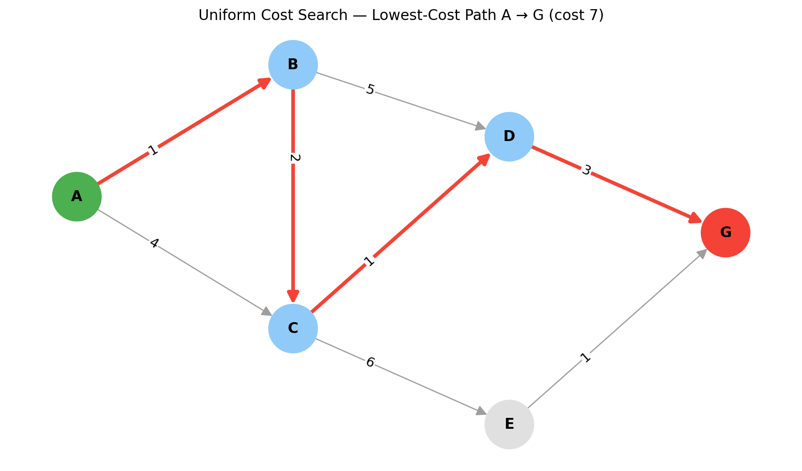

# Uniform Cost Search (UCS)

## Experiment Information

- **Experiment Number:** 05
- **Subject:** Artificial Intelligence / Python Practical
- **Aim:** To write and execute a Python program that implements the Uniform Cost Search algorithm to find the lowest-cost path in a weighted graph.
- **Programming Language:** Python 3
- **Algorithm:** Uniform Cost Search (Uninformed Search)

## Objective

The objective is to understand how an uninformed search algorithm can use edge costs to find the cheapest path from a start node to a goal node, by always expanding the node with the lowest cumulative path cost.

## Introduction

Breadth-First Search finds the path with the fewest edges, but it ignores edge costs. Uniform Cost Search fixes this for weighted graphs: instead of expanding nodes level by level, it always expands the node that is currently cheapest to reach from the start.

## Theory

- UCS is an **uninformed search** — it uses no heuristic, only the actual cost accumulated so far, written g(n).
- A **priority queue** (min-heap) keeps the frontier ordered by g(n), so the cheapest node is always removed first.
- A **visited set** prevents a node from being expanded more than once.
- The goal test is applied when a node is **removed** from the queue, not when it is added. This is what guarantees the path found is the cheapest.
- UCS requires all edge costs to be **non-negative**.
- If every edge has the same cost, UCS behaves like BFS.

## How UCS Works

1. Put the start node in the priority queue with cost 0.
2. Remove the node with the lowest cumulative cost.
3. If it was already visited, skip it.
4. Mark it as visited.
5. If it is the goal, stop — this path is the lowest-cost path.
6. Otherwise, add each unvisited neighbour to the queue with cost = current cost + edge cost.
7. Repeat until the goal is found or the queue is empty.

## Data Structure Used

A **priority queue implemented with a min-heap** (`heapq`). Each entry is a tuple `(cumulative_cost, node, path_so_far)`, so Python always pops the entry with the smallest cumulative cost.

## Graph Used

Weighted, directed graph. Start node: **A**. Goal node: **G**.

| Node | Neighbours (edge cost) |
|------|------------------------|
| A | B (1), C (4) |
| B | C (2), D (5) |
| C | D (1), E (6) |
| D | G (3) |
| E | G (1) |
| G | — |



*The lowest-cost path (A → B → C → D → G) is highlighted in red.*

## Algorithm

1. Initialize a priority queue with `(0, start, [start])`.
2. Create an empty visited set.
3. Remove the entry with the smallest cumulative cost from the queue.
4. If the node is already visited, skip it.
5. Mark the node as visited.
6. If the node is the goal, return its path and cost.
7. Otherwise, push every unvisited neighbour with cost = current cost + edge cost.
8. Repeat until the goal is found or the queue is empty.

## Python Implementation

The full implementation is available at [`../src/uniform_cost_search.py`](../src/uniform_cost_search.py).

**Key parts of the code:**
- `heapq` orders the queue by cumulative cost.
- Each queue entry stores the path so far, so the final path can be returned directly.
- The `visited` set skips stale, more expensive entries for a node that was already expanded.
- The function returns `(None, None)` if the goal cannot be reached.

## Execution

Run the program from the repository root:

```
python src/uniform_cost_search.py
```

## Expected Output

```
Uniform Cost Search Path:
A -> B -> C -> D -> G
Total Cost: 7
```

## Step-by-Step Execution

| Step | Removed from queue | Cost | Action |
|------|--------------------|------|--------|
| 1 | A | 0 | Add B (1), C (4) |
| 2 | B | 1 | Add C (3), D (6) |
| 3 | C | 3 | Add D (4), E (9) |
| 4 | C (via A) | 4 | Already visited — skipped |
| 5 | D | 4 | Add G (7) |
| 6 | D (via B) | 6 | Already visited — skipped |
| 7 | G | 7 | Goal reached |

The fewest-edge path is A → B → D → G (3 edges, cost 9). UCS returns A → B → C → D → G (4 edges) because its total cost of 7 is lower. This is exactly the case where BFS and UCS give different answers.

## Time Complexity

For a heap-based graph search, the time complexity is **O((V + E) log V)**, where V is the number of vertices and E is the number of edges. In the general theoretical form it is written O(b^(1 + C*/ε)), where b is the branching factor, C* is the cost of the optimal solution and ε is the smallest edge cost.

## Space Complexity

**O(V)** for the visited set and the priority queue in the graph-search setting. The general theoretical form is also O(b^(1 + C*/ε)).

## Advantages

- Finds the lowest-cost path when all edge costs are non-negative.
- Complete: it finds a solution if one exists (with edge costs above zero).
- Simple to implement with a priority queue.
- Works on weighted graphs, where BFS does not.

## Disadvantages

- It uses no heuristic, so it may explore many nodes in every direction.
- It can use a lot of memory on large graphs.
- It can be slower than informed methods such as A* because it has no sense of where the goal is.
- It does not work with negative edge costs.

## Applications

- Route and road-network path finding
- Network routing
- Cost-based planning problems
- Any search where actions have different costs

## UCS vs BFS

| Feature | BFS | UCS |
|---------|-----|-----|
| Expands | Shallowest node | Lowest cumulative cost node |
| Data structure | FIFO queue | Priority queue |
| Uses edge costs? | No | Yes |
| Optimal for | Fewest edges (unweighted) | Lowest total cost (non-negative weights) |

## UCS vs Best First Search vs A*

| Feature | UCS | Best First Search | A* |
|---------|-----|-------------------|----|
| Priority | g(n) | h(n) | g(n) + h(n) |
| Uses heuristic? | No | Yes | Yes |
| Optimal? | Yes (non-negative costs) | Not guaranteed | Under suitable conditions |

## Viva Questions

1. **What is Uniform Cost Search?**
   It is an uninformed search algorithm that always expands the node with the lowest cumulative path cost.

2. **Which data structure does UCS use?**
   A priority queue (min-heap) ordered by cumulative cost.

3. **What is g(n)?**
   The actual cost of the path from the start node to node n.

4. **Does UCS use a heuristic?**
   No. It uses only the cost accumulated so far.

5. **Is UCS optimal?**
   Yes, when all edge costs are non-negative.

6. **What is the difference between UCS and BFS?**
   BFS finds the path with the fewest edges, while UCS finds the path with the lowest total cost.

7. **What is the difference between UCS and A*?**
   UCS uses g(n) only, while A* uses g(n) + h(n).

8. **When is the goal tested in UCS, and why?**
   When the node is removed from the queue, because that is when its cost is guaranteed to be the lowest.

9. **What is the time complexity of UCS?**
   O((V + E) log V) with a heap-based implementation.

## Conclusion

Uniform Cost Search was implemented in Python using a priority queue ordered by cumulative path cost. The experiment shows that UCS finds the lowest-cost path, A → B → C → D → G with cost 7, even though a path with fewer edges exists.
